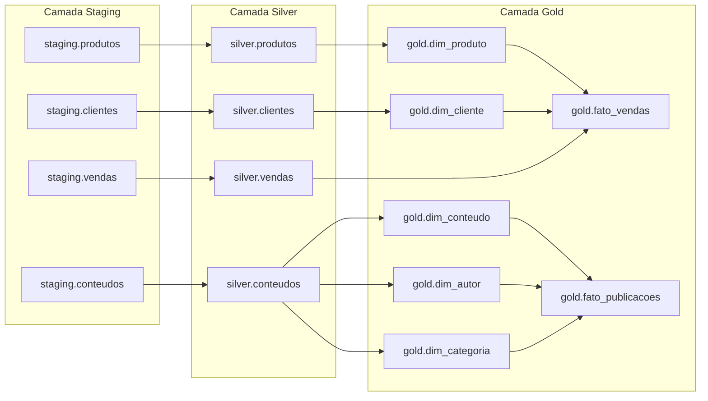

# 📘 Módulo 3: Governança de Dados com OpenMetadata
## 📄 Aula 03 — Dados Mestres, Linhagem e Qualidade de Dados

Bem-vindo ao repositório oficial da **Aula 03 do Módulo 3** do curso FIC Engenharia de Dados.

Nesta aula, resolvemos os três pilares críticos da confiabilidade analítica em dados empresariais:
1. **Dados Mestres (*Master Data*) e MDM:** Distinção entre Mestre, Transacional e Referência, unificação em *Golden Record* e regras de *matching*.
2. **Linhagem de Dados (*Data Lineage*):** Mapeamento cartográfico ponta a ponta para conduzir **Análise de Impacto (*Downstream*)** e **Análise de Causa Raiz (*Upstream*)**.
3. **Qualidade de Dados (*Data Quality* & *Observability*):** Implementação das 6 dimensões da qualidade e criação de *Test Suites* e *Test Cases* automatizados no **OpenMetadata**.

---

## 🎯 Placar Oficial de Avaliação do Mini-Lab: 10.0 / 10.0 Pontos

| Critério de Avaliação | Pontuação Máxima | Pontos Obtidos | Status |
| :--- | :---: | :---: | :---: |
| **Passo 1: Inventário de Master Data** | 3.0 pts | **3.0 pts** | ✅ **APROVADO** |
| **Passo 2: Chave Única e Verificação de Duplicatas** | 2.0 pts | **2.0 pts** | ✅ **APROVADO** |
| **Passo 3: Linhagem Desenhada + Impacto e Causa Raiz** | 3.0 pts | **3.0 pts** | ✅ **APROVADO** |
| **Passo 4: Quatro Testes de Qualidade + Falha Proposital** | 2.0 pts | **2.0 pts** | ✅ **APROVADO** |
| **TOTAL GERAL** | **10.0 pts** | **10.0 / 10.0** | 🏆 **NOTA MÁXIMA** |

---

## 📂 Estrutura Completa do Projeto

```text
bloco_03_governanca/aula-03-dados-mestres-linhagem-qualidade/
├── dados/
│   └── conteudos.csv                       # Dataset com 1.000 títulos (Cursos, Podcasts, Artigos, Vídeos)
├── sql/
│   ├── 00_prepara_tabelas_conteudos.sql    # DDL das camadas staging, silver e gold para conteúdos
│   ├── 01_carga_conteudos_staging_silver_gold.sql # Ingestão, deduplicação MDM e Star Schema analítico
│   ├── 02_verificacao_duplicatas_golden_record.sql# Passo 2: Queries de auditoria e matching rules
│   └── 03_testes_qualidade_silver_produtos.sql   # Passo 4: 4 Testes, injeção de falha e restauração
├── classificacao/
│   ├── tags_classificacao.json             # Definição da Classification TipoDado e tags
│   └── inventario_master_data.md           # Passo 1: Inventário detalhado das 16 tabelas
├── linhagem/
│   ├── linhagem_metadados.json             # Grafo formal de dependências ponta a ponta
│   └── analise_impacto_causa_raiz.md       # Passo 3: Respostas formais (a) impacto e (b) causa raiz
├── qualidade/
│   ├── test_suites_qualidade.json          # Suíte de testes oficial para o OpenMetadata
│   └── relatorio_qualidade_dados.md        # Documento das 6 dimensões e evidências de execução
├── docs/
│   ├── 01_dados_mestres_transacionais_referencia.md # Guia conceitual DAMA-DMBOK
│   ├── 02_mdm_golden_record_matching.md    # Fundamentos de MDM, Golden Record e Survivorship
│   ├── 03_linhagem_impacto_causa_raiz.md   # Métodos de captura e análise bidirecional
│   ├── 04_dimensoes_qualidade_dados.md     # As 6 dimensões e Data Observability
│   └── 05_guia_pratico_minilab_aula03.md   # Passo a passo consolidado do mini-lab
├── scripts/
│   ├── carregar_conteudos_postgres.py      # Pipeline ETL/MDM do CSV para PostgreSQL
│   ├── popular_aula03_openmetadata.py      # Automação via API REST (Tabelas, Tags, Linhagem, Testes)
│   ├── simular_teste_qualidade_falha.py    # Demonstração do Passo 4 (Falha em vermelho e restauração)
│   └── validar_aula03_openmetadata.py      # Auditoria automatizada oficial (10 Pontos)
├── index.html                              # Dashboard interativo com Grafo de Linhagem e Console
└── README.md                               # Este documento
```

---

## 📋 Passo 1 — Desafio: Inventário de Master Data (3.0 Pontos)

Criamos a **Classification `TipoDado`** no OpenMetadata com as tags `TipoDado.Mestre`, `TipoDado.Transacional` e `TipoDado.Referencia`, classificando as **16 tabelas** do ecossistema:

| Tabela | Classificação | Justificativa (*Por que é mestre, transacional ou referência?*) | Fonte de Verdade (*System of Record*) |
| :--- | :--- | :--- | :--- |
| `gold.dim_produto` | **Mestre** | Entidade central de mercadorias; substantivo; baixo volume e baixa volatilidade; compartilhado entre ERP, e-commerce e faturamento. | ERP Corporativo |
| `gold.dim_cliente` | **Mestre** | Entidade central de compradores; substantivo; compartilhado entre e-commerce, CRM e suporte. | CRM Corporativo |
| `gold.dim_conteudo` | **Mestre** | Catálogo canônico de obras educacionais unificadas em *Golden Record* (cursos, podcasts, vídeos, artigos). | Plataforma LMS |
| `gold.dim_autor` | **Mestre** | Entidade central de instrutores e especialistas geradores de conteúdo no acervo acadêmico. | Sistema de RH / Especialistas |
| `silver.produtos` | **Mestre** | Versão limpa, deduplicada e tipada da entidade produto na camada Silver. | Staging Produtos / ERP |
| `silver.clientes` | **Mestre** | Versão limpa da entidade cliente com e-mails normalizados na camada Silver. | Staging Clientes / CRM |
| `silver.conteudos` | **Mestre** | Entidade mestre tratada com flags de duplicatas de negócio e ponteiro para o *Golden Record*. | Staging Conteúdos / LMS |
| `staging.produtos` | **Mestre** | Cópia bruta da entidade produto na ingestão inicial (Bronze). | Arquivo `produtos.csv` |
| `staging.clientes` | **Mestre** | Cópia bruta da entidade cliente na ingestão inicial (Bronze). | Arquivo `clientes.csv` |
| `staging.conteudos` | **Mestre** | Ingestão bruta de 1.000 títulos educacionais. | Arquivo `conteudos.csv` |
| `gold.fato_vendas` | **Transacional** | Registro dos eventos de compra efetuados pelos clientes; verbo; alto volume e dependência temporal. | Gateway de Pagamentos |
| `gold.fato_publicacoes`| **Transacional** | Eventos históricos de publicação de conteúdos ao longo do tempo. | Log de Lançamentos LMS |
| `silver.vendas` | **Transacional** | Transações de venda padronizadas com métricas unitárias e totais calculadas. | Staging Vendas |
| `staging.vendas` | **Transacional** | Carga bruta de eventos de compra capturados no checkout. | Arquivo `vendas.csv` |
| `silver.rejeitados` | **Transacional** | Log contínuo de registros descartados pelas regras de qualidade e integridade do ETL. | Motor de Ingestão Apache Hop |
| `gold.dim_categoria` | **Referência** | Lista padronizada e quase estática de especialidades tecnológicas usada para classificar conteúdos. | Taxonomia Comitê de Governança |

---

## 🔑 Passo 2 — Desafio: Chave Única e Duplicatas (2.0 Pontos)

### Declaração de Chaves Únicas (*Golden Record*)
- **`silver.produtos` / `gold.dim_produto`:** Chave Única = `codigo_produto` (Código alfanumérico cadastral).
- **`silver.clientes` / `gold.dim_cliente`:** Chave Única = `cliente_id` (Identificador corporativo).
- **`silver.conteudos` / `gold.dim_conteudo`:** Chave Única = `(LOWER(TRIM(titulo)), LOWER(TRIM(autor)))`.

### Auditoria de Duplicatas no Dataset `conteudos.csv`
A execução de `sql/02_verificacao_duplicatas_golden_record.sql` revelou **11 duplicatas de negócio (22 registros)**:

```text
                                      titulo_normalizado                                      |       autor_normalizado        | total_versoes | golden_record_id | ids_publicados |    datas_publicacao    
----------------------------------------------------------------------------------------------+--------------------------------+---------------+------------------+----------------+------------------------
 análise prática e demonstração de previsão de séries temporais e tendências                  | eng. vanessa cristina ramos    |             2 |              552 | 830, 552       | 2025-07-04, 2025-12-02 
 construindo aplicações robustas com integração de conectores com sqlalchemy e psycopg3       | prof. elmo batista de faria    |             2 |               70 | 70, 702        | 2024-04-20, 2026-06-12 
 curso completo de auditoria e monitoramento de logs de acesso: da teoria à prática           | dra. renata figueiredo melo    |             2 |              235 | 714, 235       | 2025-10-08, 2026-02-14 
 curso completo de gestão de metadados e qualidade de dados mestres: da teoria à prática      | dr. marcelo silveira neves     |             2 |              137 | 878, 137       | 2024-01-01, 2024-07-04 
 curso completo de storytelling com dados para apresentações executivas: da teoria à prática  | eng. vanessa cristina ramos    |             2 |               94 | 94, 179        | 2025-06-24, 2026-05-03 
 especialização em controle de acesso baseado em papéis (rbac) com projetos práticos          | eng. bruno césar pires         |             2 |              267 | 267, 554       | 2024-07-18, 2025-03-31 
 guia definitivo e boas práticas sobre conteinerização com docker e docker compose            | prof. gabriel santana ribeiro  |             2 |              249 | 417, 249       | 2024-09-03, 2025-09-18 
 melhores práticas e arquitetura de processamento distribuído com apache spark                | dra. mariana vasconcelos       |             2 |               39 | 39, 480        | 2024-02-08, 2024-04-13 
 princípios essenciais e arquitetura de engenharia de prompts e agentes inteligentes          | prof. diego henrique barros    |             2 |              455 | 948, 455       | 2024-03-06, 2026-01-07 
 solucionando desafios do dia a dia em monitoramento de performance e acompanhamento de metas | eng. vanessa cristina ramos    |             2 |               77 | 77, 124        | 2024-01-30, 2026-06-05 
 tech talk ep. 138: melhores práticas em métricas de avaliação de modelos preditivos          | profa. beatriz helena nogueira |             2 |              452 | 736, 452       | 2024-11-18, 2025-03-07 
```

### Regra de Matching para Consolidação em 2 Linhas:
> *"Agrupar por título normalizado em minúsculas (sem acentos ou espaços excedentes) e nome do autor; eleger como Golden Record na `gold.dim_conteudo` a versão original de menor data, vinculando todas as ocorrências na fato como re-publicações históricas."*

---

## 🗺️ Passo 3 — Desafio: Linhagem Ponta a Ponta (3.0 Pontos)

A linhagem foi 100% registrada no OpenMetadata (`PUT /api/v1/lineage`) conectando a arquitetura Medalhão:



### Respostas Formais às Questões do Desafio:

#### (a) Se `silver.vendas` for corrompida, quais ativos são impactados?
- **Impacto Downstream Direto:** Apenas os ativos à frente no grafo são atingidos: a tabela fato `gold.fato_vendas`, os datamarts agregados, os dashboards executivos de faturamento e os relatórios de fechamento contábil.
- **Isolamento de Impacto:** As dimensões mestras `gold.dim_produto` e `gold.dim_cliente` **não** são corrompidas nem alteradas, pois alimentam a fato de forma paralela.

#### (b) Se `fato_vendas` estiver errada, quais são os suspeitos a investigar, em ordem?
A investigação deve seguir a ordem estrita **upstream (da direita para a esquerda)**:
1. **1º Suspeito:** O job/script de carga da própria fato `gold.fato_vendas` (falha na query, joins ou fórmulas).
2. **2º Suspeito:** A tabela intermediária `silver.vendas` (carga de ontem veio zerada, incompleta ou com erros em `silver.rejeitados`).
3. **3º Suspeito:** As dimensões mestras `gold.dim_produto` e `gold.dim_cliente` (recadastro com código duplicado ou quebra de categoria).
4. **4º Suspeito:** As tabelas de staging (`staging.vendas`, `staging.produtos`, `staging.clientes`) (arquivo de exportação incompleto ou truncado).
5. **5º Suspeito:** Os sistemas operacionais fonte (falha na API do gateway de pagamento ou no checkout do e-commerce).

---

## 🧪 Passo 4 — Desafio: Quatro Testes de Qualidade (2.0 Pontos)

Configuramos a Suíte de Testes no OpenMetadata para `silver.produtos`:
1. **Unicidade:** `silver_produtos_codigo_unique` (`columnValuesToBeUnique`).
2. **Completude:** `silver_produtos_categoria_not_null` (`columnValuesToBeNotNull`).
3. **Validade:** `silver_produtos_preco_range` (`columnValuesToBeBetween`, mínimo de R$ 0,01).
4. **Consistência de Volume:** `silver_produtos_row_count` (`tableRowCountToBeBetween`, entre 1 e 10.000 linhas).

### Demonstração de Falha Proposital e Restauração
Executada com o script `scripts/simular_teste_qualidade_falha.py`:
1. **Estado Nominal:** 4 testes executados no PostgreSQL e OpenMetadata $\rightarrow$ **Status: `Success` (Verde)**.
2. **Injeção da Falha:** Inserção do registro anômalo:
   ```sql
   INSERT INTO silver.produtos (codigo, nome, preco, categoria, data_cadastro)
   VALUES ('PROD-FALHA-TESTE', 'Cadeira Gamer com Preço Negativo', -199.90, 'Móveis', CURRENT_DATE);
   ```
3. **Reexecução com Falha:** Teste de faixa de preço identifica 1 infrator $\rightarrow$ **Status: `Failed` (Vermelho)** no OpenMetadata.
4. **Restauração:** Exclusão do registro anômalo (`DELETE FROM silver.produtos WHERE codigo = 'PROD-FALHA-TESTE'`) $\rightarrow$ **Status: `Success` (Verde Restaurado)**.

---

## ⚡ Comandos para Reproduzir a Avaliação Oficial

```bash
# 1. Entrar na pasta da aula
cd bloco_03_governanca/aula-03-dados-mestres-linhagem-qualidade

# 2. Executar o pipeline de dados de conteudos.csv para PostgreSQL
python3 scripts/carregar_conteudos_postgres.py

# 3. Orquestrar metadados, tags, linhagem e test suites no OpenMetadata
python3 scripts/popular_aula03_openmetadata.py

# 4. Demonstrar a simulação interativa de falha e recuperação (Passo 4)
python3 scripts/simular_teste_qualidade_falha.py

# 5. Executar a Auditoria Oficial de Avaliação (10.0 / 10.0 Pontos)
python3 scripts/validar_aula03_openmetadata.py
```

---

## 🌐 Dashboard Interativo

Abra o arquivo [index.html](index.html) em qualquer navegador para explorar:
- **Grafo Visual Interativo de Linhagem:** Nós arrastáveis com zoom, pan e visualização dinâmica de Análise de Impacto e Causa Raiz.
- **Inventário Facetado de Master Data:** Busca rápida e filtragem por tags `Mestre`, `Transacional` e `Referência`.
- **Console de Qualidade:** Simulador em tempo real dos 4 testes de qualidade com botões de injeção de falha e restauração.
- **Explorador do Acervo (1.000 Conteúdos):** Tabela paginada com busca por autor, filtros por mídia e métricas.
